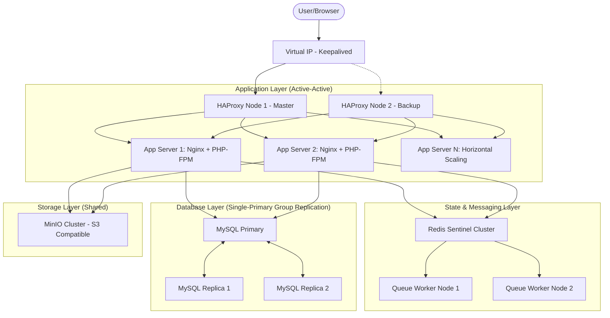

# 🏛️ High Availability & Horizontal Scalability Transformation Plan

## 1. Executive Summary
This document outlines the strategic transformation of the Laravel-based CRM from a single-node VPS deployment to a resilient, fault-tolerant, and horizontally scalable cluster. The goal is **Zero Single Point of Failure (SPOF)** and **Zero-Downtime Deployments** using a 100% self-hosted, open-source stack.

---

## 2. System Architecture Blueprint

### 2.1 Visual Overview


---

## 3. Core Objectives & Component Strategy

### 3.1 Load Balancing (Nginx / HAProxy)
*   **Technology**: HAProxy for advanced health checks and session persistence.
*   **HA Strategy**: Keepalived with VRRP (Virtual Router Redundancy Protocol) to provide a single Floating IP that automatically moves between LB nodes if one fails.
*   **Persistence**: Sticky sessions (via `SERVERID` cookie) or stateless (preferred).

### 3.2 Stateless Laravel Design
To scale horizontally, the application MUST be stateless:
1.  **Sessions**: Stored in centralized Redis.
2.  **Cache**: Stored in centralized Redis (separate database/instance from sessions).
3.  **Filesystem**: No local storage. All uploads must go to **MinIO** (self-hosted S3 alternative).
4.  **Logging**: Redirect logs to `syslog` or a centralized log aggregator (Loki/Fluentd).

### 3.3 Database Consistency (MySQL Group Replication)
We bypass traditional Master-Slave for **MySQL Group Replication (Single-Primary Mode)**:
*   **Consistency**: Synchronous replication ensures no data is lost upon commit.
*   **Failover**: Automatic leader election if the primary node goes down.
*   **Read-Splitting**: Laravel can be configured to send SELECT queries to replicas and INSERT/UPDATE to the primary.

---

## 4. Zero-Downtime Deployment Pipeline

### 4.1 Deployment Structure
The application will be deployed using an atomic symlink strategy:
```text
/var/www/130crm/
  ├── current -> releases/20231027120000
  ├── shared/
  │    ├── .env
  │    └── storage/
  └── releases/
       ├── 20231027100000/
       └── 20231027120000/ (Active)
```

### 4.2 Bash Deployment Workflow (`deploy.sh`)
```bash
#!/bin/bash
# High-level logic for SSH-based deployment
set -e

RELEASE_ID=$(date +%Y%m%d%H%M%S)
APP_PATH="/var/www/130crm"
NODES=("app-01.internal" "app-02.internal")

# 1. Build locally/CI
composer install --no-dev --optimize-autoloader
npm run build

# 2. Distribute to all nodes
for node in "${NODES[@]}"; do
    rsync -azP --delete ./ $node:$APP_PATH/releases/$RELEASE_ID
done

# 3. Migration (Single node)
ssh ${NODES[0]} "cd $APP_PATH/releases/$RELEASE_ID && php artisan migrate --force"

# 4. Atomic Switch
for node in "${NODES[@]}"; do
    ssh $node "ln -sfn $APP_PATH/releases/$RELEASE_ID $APP_PATH/current && sudo systemctl reload php8.x-fpm"
done
```

---

## 5. Failure Scenarios & Recovery Matrix

| Scenario | Impact | Auto-Recovery Mechanism | Manual Intervention |
| :--- | :--- | :--- | :--- |
| **App Server Crash** | 50% capacity loss | HAProxy marks node DOWN; routes all traffic to healthy node. | Restart PHP-FPM; Investigate OOM/Logs. |
| **Primary DB Failure** | 5-10s write pause | Cluster elects new Primary; Floating IP/ProxySQL moves. | Fix crashed node; rejoin as Replica. |
| **Redis Master Failure** | Cache/Session loss | Redis Sentinel promotes a Slave to Master. | None (Auto-handled by Sentinel). |
| **Network Partition** | "Split-Brain" risk | Nodes enter 'Read-Only' if Quorum (majority) is lost. | Force-rejoin nodes once network is stable. |

---

## 6. Security Hardening
1.  **Inter-Node Encryption**: Use TLS for MySQL replication and Redis communication.
2.  **Private Network**: All backend communication (DB, Redis, Storage) MUST occur over a private VLAN/Network Interface, inaccessible from the public internet.
3.  **Firewall**: UFW/Iptables restricted to specific internal IPs for cluster ports (33061 for DB, 26379 for Sentinel).

---

## 7. Advanced Deployment Strategies (Optional Bonus)

### 7.1 Blue-Green Deployment
To achieve near-instant rollbacks and zero-risk updates:
1.  **Blue Group**: Current production nodes.
2.  **Green Group**: New version nodes.
3.  **Process**:
    *   Deploy code to the **Green Group**.
    *   Run tests against Green internal IPs.
    *   Switch HAProxy configuration to point to Green nodes.
    *   Keep Blue nodes running for 1 hour for instant rollback if needed.

### 7.2 Canary Releases
*   Route 5-10% of traffic to a "Canary" node running the new code.
*   Monitor error rates vs the stable group.
*   If stable, roll out to the rest of the cluster.

---

## 8. Observability & Monitoring
To manage a distributed system, you must have visibility:
*   **Metrics**: **Prometheus** + **Node Exporter** on all servers.
*   **Visualization**: **Grafana** dashboard for CPU, RAM, MySQL queries/sec, and PHP-FPM busy workers.
*   **Logging**: **Loki** + **Promtail** to search logs across all nodes from a single interface.
*   **Uptime**: **Uptime Kuma** for external heartbeat monitoring and alerting (Telegram/Discord/Slack).

---

## 9. Implementation Roadmap
1.  **Phase 1**: Convert Laravel to use Redis for Sessions and MinIO for files.
2.  **Phase 2**: Set up MySQL Group Replication (3 nodes).
3.  **Phase 3**: Configure HAProxy + Keepalived for Entry Point.
4.  **Phase 4**: Script and test the SSH-based atomic deployment.
5.  **Phase 5**: Implement Monitoring (Prometheus/Grafana) and Log Centralization.
